# Huang.github.io

# 个人情况介绍
## 基本信息
<table>
<tr>
<td width="60%" valign="top">

- **姓名**：黄晓静  
- **学校**：东北大学（秦皇岛）  
- **专业**：计算机科学与技术  
- **年级**：2022级
- **电话**：19565385900
- **邮箱**：19565385900@163.com  

</td>
<td width="40%" valign="top" align="center">

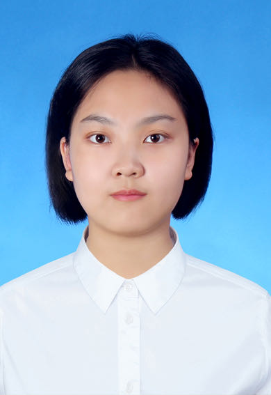

</td>
</tr>
</table>

## 📊 学业成绩
### GPA与排名
- **GPA**：4.31/5.0（专业前1.5%）  
- **核心课程成绩**：
  - 高等数学 100/100
  - 离散数学 100/100
  - 线性代数 99/100
  - C++程序设计 99/100
  - 数据结构与算法：98/100  
  - 数据库原理：98/100  
  - 操作系统：95/100
- **英语水平**：
  - CET4：613
  - CET6：522

  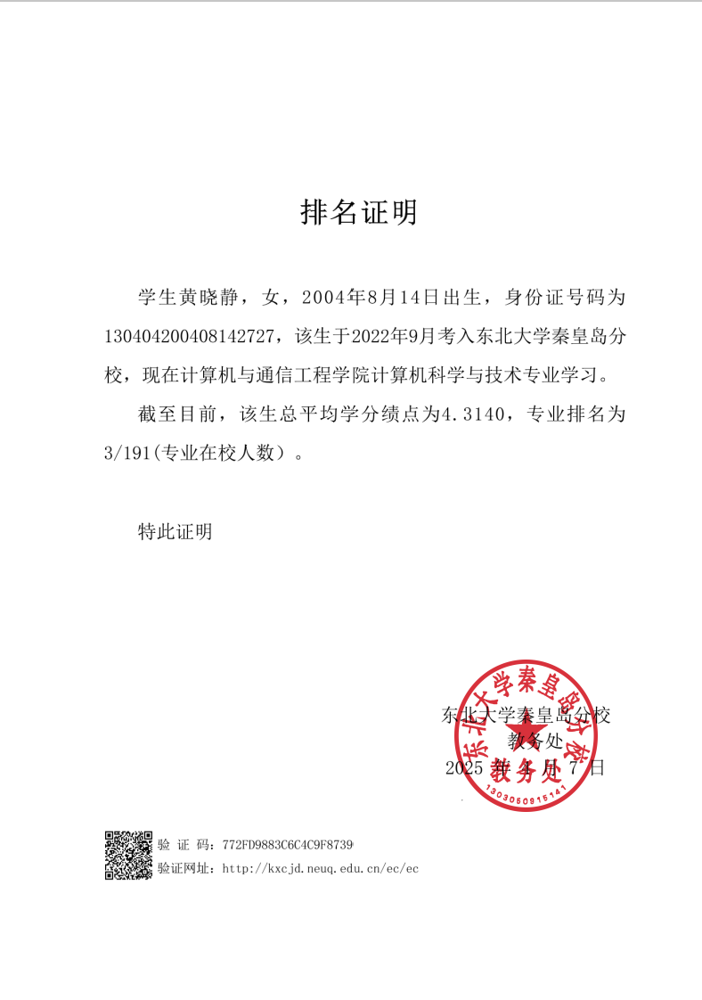
  
  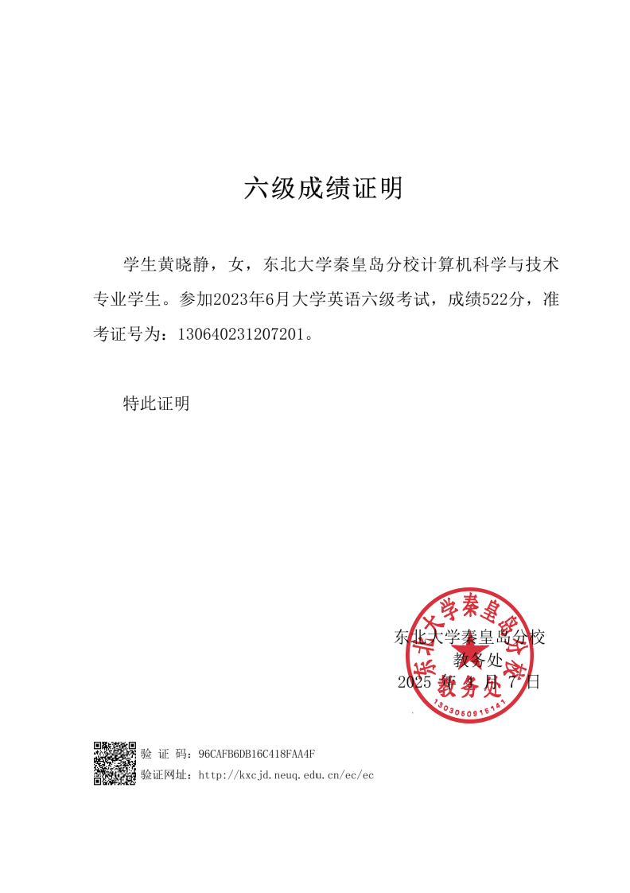

---

## 🔬 科创经历
### 项目1：多模态乳腺影像融合分析：乳腺癌早期筛查与智能诊断研究
- **时间**：2024.12 - 至今
- **背景**：针对单一类型医学影像难以辅助疾病诊断的难题，多模态医学图像融合技术可以将多幅图像中的病理信息结合到一幅图像中，利用了不同模态图像的优势，为病情的诊断提供了更加合理可靠的依据。
- **职责**：图像配准工作
- **任务**：
  - 在 UNet 网络架构的基础上，通过对 fixed-image 和 moving-image 进行编码和解码生成一个形变场；
  - 通过空间变换网络（STN）根据形变场对待配准图像进行每个像素的重塑（利用双线性插值）得到 moved-image；
  - 最终，计算 fixed-image 与 moved-image 的 Dice Score 值为 0.823，表明模型较好地实现了图像配准。
  

  
  <!-- 新增包装层 -->
    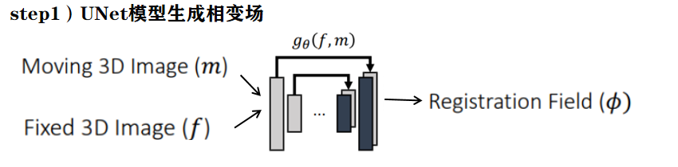
  

  

    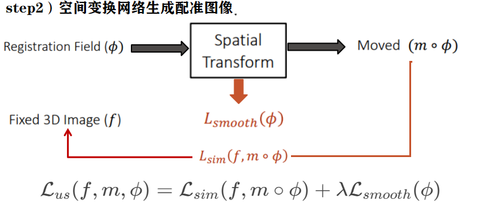
  

  
### 项目2：《Olympic Medal Table Prediction Model Based on LSTM-Transformer with Transfer Learning》
- **时间**：2024.12 - 2024.02
- **背景**：为实现奥运会奖牌的预测，为体育资源的规划提供科学依据，本论文开发了一个基于 LSTM-Transformer 模型的奥林匹克奖牌预测系统，并利用迁移学习技术针对不同国家定制预测模型。
- **任务**：
  - 通过构建 LSTM 层对奥运奖牌数据进行初步处理，捕捉局部时间依赖性；
  - Transformer 层被应用于 LSTM 层的输出，利用自注意力机制来捕捉奥运奖牌数据中的全局依赖性；
  - 运用 SHAP 分析方法量化各个运动项目对奖牌分布的贡献，为国家体育委员会提供了战略规划和资源分配的科学依据。

  
  <!-- 新增包装层 -->
    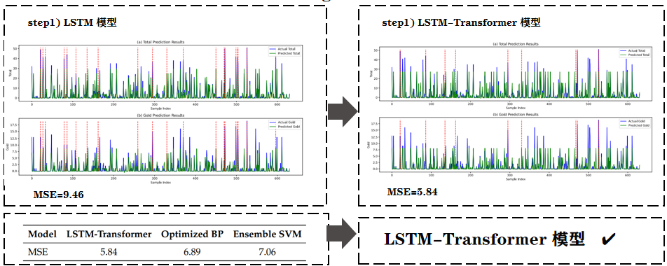
  

  

    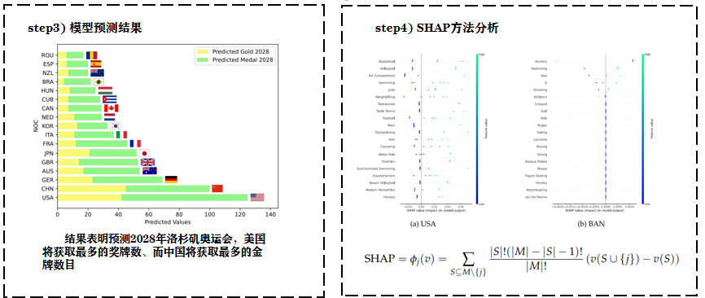
  

### 项目3：基于最大期望利润模型的生产决策优化
- **时间**：2024.09 - 2024.11
- **背景**：某电子产品生产企业在生产过程中面临零配件采购、装配及成品质量控制等多阶段决策问题。企业需要科学制定采购及生产策略，以实现生产利益最大化。
- **任务**：
  - 构建最大期望利润模型，设定决策目标为卖出单个成品获得的最大期望利润。建立目标函数，综合考虑零配件成本、检测成本、装配成本、次品率、调换损失、拆解费用等因素，找到最优决策方案，预测单个产品的最大期望利润为19.4元;
    

     
  <!-- 新增包装层 -->
    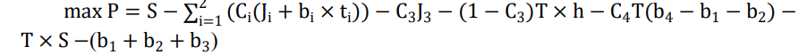
  

  - 构建多工序生产决策模型，在最大期望利润模型的基础上，进一步考虑多工序生产的特点。将半成品和成品纳入决策分析中，分析其不合格概率，预测单个产品的最大期望利润为20.3元;

 
  

    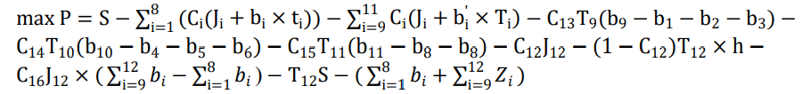
  

### 项目4：中国宠物食品产业可持续发展战略研究与预测分析
- **时间**：2025.01 - 2025.02
- **背景**：随着社会的发展和人们生活水平的提高，宠物食品市场迎来了巨大的发展机遇。然而，面对全球市场竞争加剧以及国际贸易政策变化等挑战，如何制定科学合理的可持续发展战略，成为中国宠物食品产业亟待解决的问题。
- **任务**：
  - 对于市场数据使用3-sigma测试识别异常值，使用Kolmogorov-Smirnov检验验证数据变量P值均大于0.05，数据服从正态分布;
  - 基于Spearman秩相关性检验建立岭回归模型（参数k=0.188）,分析各因素对宠物行业规模的影响，建立灰色预测模型，预测未来三年中国宠物市场的规模，预测值分别为2674.97亿元、2884.32亿元和3104.42亿元;
  - 建立关税影响模型，通过比较预测值与实际值，得出结论高关税会降低中国宠物食品的出口量和在外国市场的份额，提出的可持续发展战略。

## 🏆 个人荣誉
| 奖项名称         | 颁发单位       | 时间     |
|------------------|----------------|----------|
| 校综合二等奖学金*3     |东北大学秦皇岛分校          | 2023.10 2024.05 2024.11|
| 校综合三等奖学金       |东北大学秦皇岛分校          | 2023.05|
| 优秀学生干部     | 东北大学秦皇岛分校         | 2023.11  |
| 优秀团干部标兵   | 东北大学秦皇岛分校         | 2023.11  |
| 三好学生     | 东北大学秦皇岛分校         | 2024.11  |
| 优秀志愿者     | 共青团东北大学秦皇岛分校委员会         | 2024.04  |

  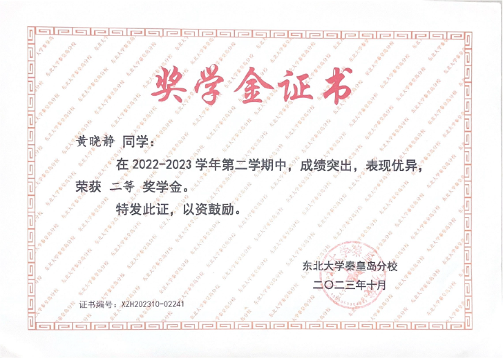
  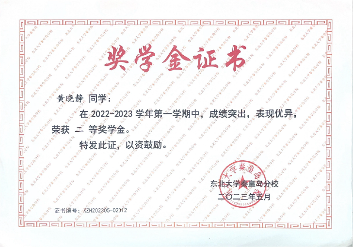
  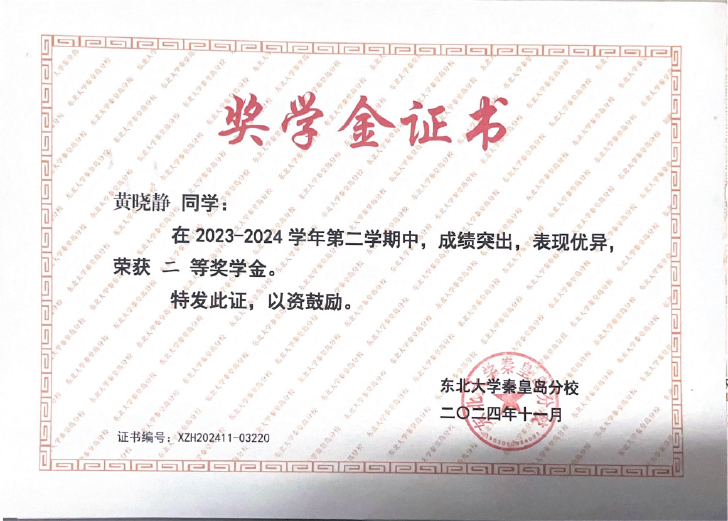
  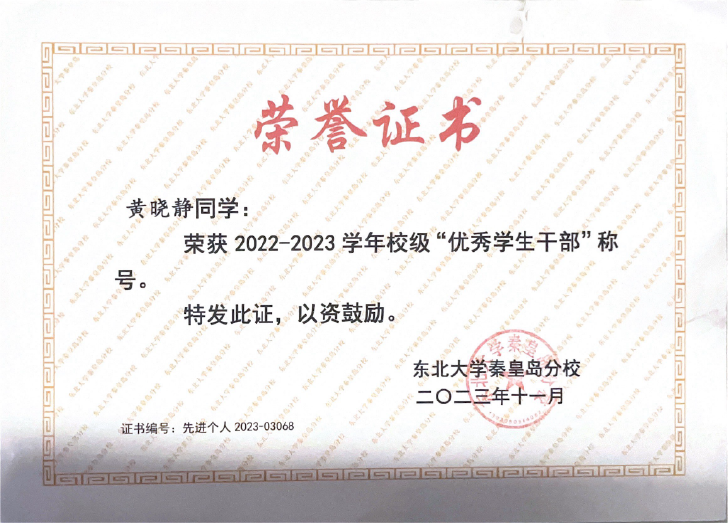
  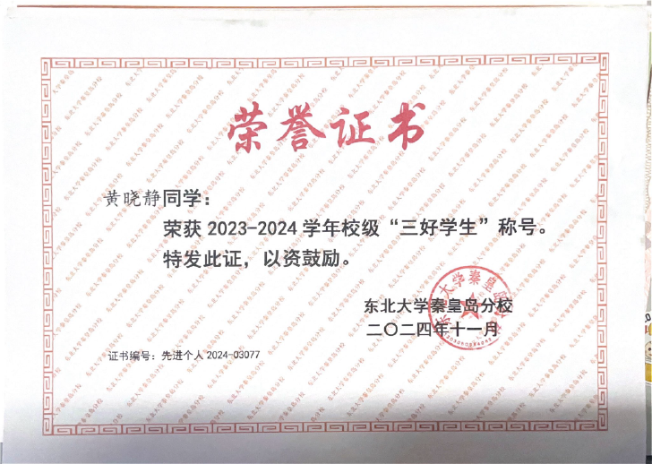
  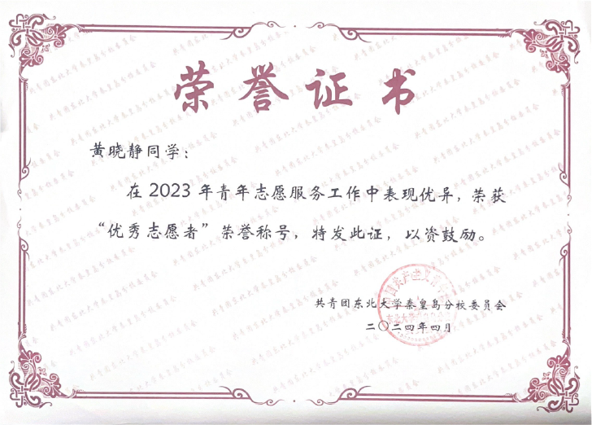
  

---

## 🏆 竞赛荣誉
| 奖项名称         | 颁发单位       | 时间     |
|------------------|----------------|----------|
| 全国大学生数学建模竞赛省级一等奖       | 中国工业与应用数学学会      | 2025.09|
| 国际大学生数学竞赛H奖     | 美国数学及其应用联合会          | 2024.05|
| 亚太地区大学生数学建模竞赛国家级三等奖  |亚太地区大学生数学建模竞赛组委会| 2025.01|
| 全国大学生数学竞赛省级三等奖     | 东北大学秦皇岛分校         | 2023.11  |

  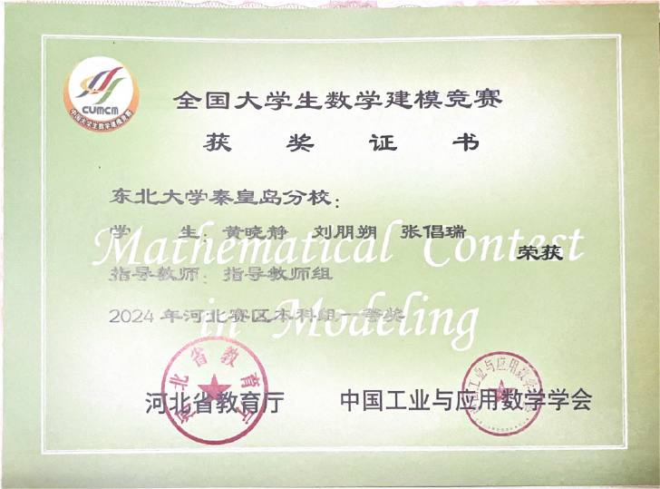
  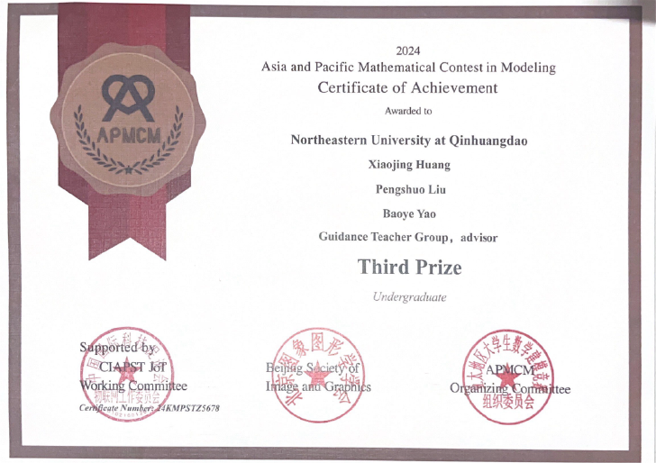
  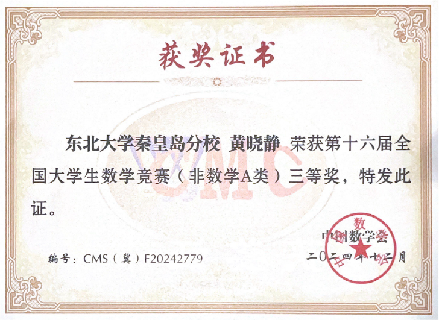
 
  

## 📌 其他技能
- **编程语言**：Python（熟练）、C++、Java  
- **工具框架**：PyTorch、TensorFlow、MySQL  
- **硬件设计能力**：Vivado

---

