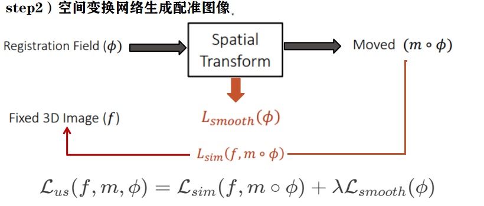
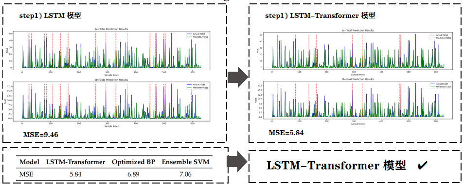
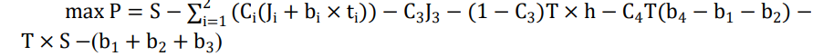

# Huang.github.io

# 个人情况介绍

## 基本信息
<table>
<tr>
<td width="60%" valign="top">

- **姓名**：黄晓静  
- **学校**：东北大学（秦皇岛）  
- **专业**：计算机科学与技术  
- **年级**：2022级  
- **电话**：19565385900  
- **邮箱**：19565385900@163.com  

</td>
<td width="40%" valign="top" align="center">

</td>
</tr>
</table>

## 📊 学业成绩
### GPA与排名
- **GPA**：4.31/5.0（专业前1.5%）  
- **核心课程成绩**：
  - 高等数学 100/100
  - 离散数学 100/100
  - 线性代数 99/100
  - C++程序设计 99/100
  - 数据结构与算法：98/100  
  - 数据库原理：98/100  
  - 操作系统：95/100
- **英语水平**：
  - CET4：613
  - CET6：522

  
  
  

---

## 🔬 科创经历

### 项目1：多模态乳腺影像融合分析
- **时间**：2024.12 - 至今
- **职责**：图像配准工作
- **任务**：
  - 基于 UNet 和 STN 的图像配准，最终 Dice Score = 0.823

  
  

### 项目2：Olympic Medal Table Prediction
- **时间**：2024.12 - 2024.02
- **任务**：基于 LSTM+Transformer 的奖牌预测，使用 SHAP 分析模型解释性

  
  

### 项目3：最大期望利润生产优化
- **时间**：2024.09 - 2024.11
- **任务**：构建单阶段与多工序期望利润模型

  
  

### 项目4：宠物食品产业可持续发展分析
- **时间**：2025.01 - 2025.02
- **任务**：异常值识别、岭回归建模、灰色预测模型、关税影响分析

---

## 🏆 个人荣誉

| 奖项名称         | 颁发单位       | 时间     |
|------------------|----------------|----------|
| 校综合二等奖学金*3     |东北大学秦皇岛分校          | 2023.10 2024.05 2024.11|
| 校综合三等奖学金       |东北大学秦皇岛分校          | 2023.05|
| 优秀学生干部     | 东北大学秦皇岛分校         | 2023.11  |
| 优秀团干部标兵   | 东北大学秦皇岛分校         | 2023.11  |
| 三好学生     | 东北大学秦皇岛分校         | 2024.11  |
| 优秀志愿者     | 共青团东北大学秦皇岛分校委员会         | 2024.04  |

  
  
  
  
  
  

---

## 🏆 竞赛荣誉

| 奖项名称         | 颁发单位       | 时间     |
|------------------|----------------|----------|
| 全国大学生数学建模竞赛省级一等奖       | 中国工业与应用数学学会      | 2025.09|
| 国际大学生数学竞赛H奖     | 美国数学及其应用联合会          | 2024.05|
| 亚太地区大学生数学建模竞赛国家级三等奖  |亚太地区大学生数学建模竞赛组委会| 2025.01|
| 全国大学生数学竞赛省级三等奖     | 东北大学秦皇岛分校         | 2023.11  |

  
  
  

---

## 📌 其他技能

- **编程语言**：Python（熟练）、C++、Java  
- **工具框架**：PyTorch、TensorFlow、MySQL  
- **硬件设计能力**：Vivado

